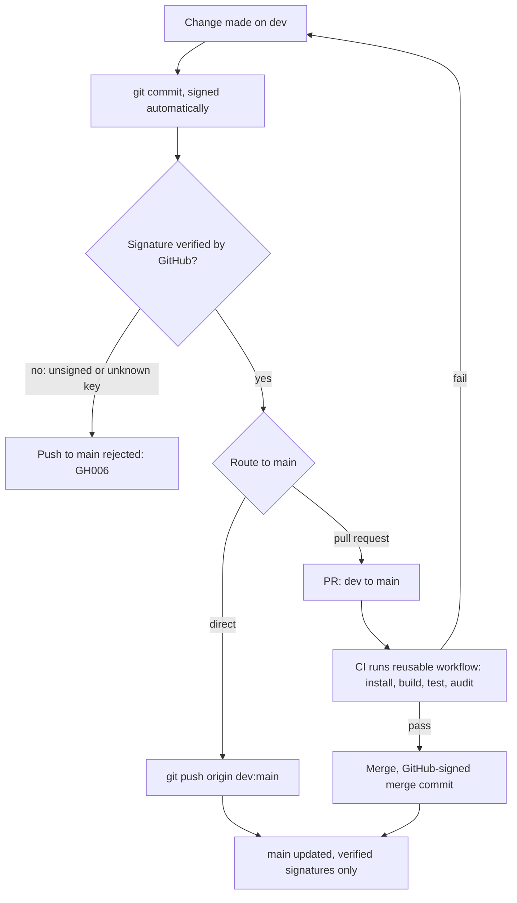

# caller-repo

A small Node.js application that is the reference consumer of this org's reusable build
workflow: [enofei/reusable-build-test](https://github.com/enofei/reusable-build-test).

## Why this repository exists

Two goals. First, prove that adopting the shared pipeline is a one-job change: everything
CI-related lives in `.github/workflows/ci.yml`, and the rest of the repository is ordinary
application code. Second, act as the testbed for this org's branch and signing policy, which
both repositories enforce identically.

## How CI works

```yaml
jobs:
  build-and-test:
    uses: enofei/reusable-build-test/.github/workflows/build-test.yml@84333a75913b870266360fe802b5c7a56ca79564  # v1.0.0
    with:
      node-version: '24'
      test-command: 'npm run test:ci'
      security-checks: true
```

On every pull request to `main` or `dev`, the reusable workflow checks out this
repository, installs from the lockfile, builds, runs the tests, and audits dependencies.
The steps themselves are maintained in the reusable repository; this file only supplies
inputs.

## Branch and signing policy

- `dev` is where work happens. Push to it freely.
- `main` accepts only commits with verified signatures. Branch protection applies to
  administrators too, so unsigned or unverified pushes are rejected by GitHub with `GH006`.
- Signing is automatic on a configured machine: `commit.gpgsign=true` with an SSH signing
  key registered on the GitHub account. `git verify-commit HEAD` checks a commit locally.
- Pull requests can be merged to `main`; GitHub signs its own merge commits, so they pass
  the gate.



## Application layout

| Path | Purpose |
|---|---|
| `src/index.js` | Application code (`slugify`, `greet`) |
| `scripts/build.js` | Bundles `src/` into `dist/` and writes build metadata |
| `test/index.test.js` | Tests on Node's built-in `node:test` runner |

No third-party runtime dependencies. Requires Node.js 24 (current LTS); `engines` is set to
`>=24`.

## Local development

```bash
npm ci
npm run build
npm run test:ci
npm audit --audit-level=high
```

These are the same commands CI runs.

## Updating the workflow pin

The `uses:` reference is SHA-pinned to a release tag of `reusable-build-test` with a
`# vX.Y.Z` comment. To resolve a new tag:

```bash
git clone https://github.com/enofei/reusable-build-test.git
./reusable-build-test/scripts/resolve-action-sha.sh enofei/reusable-build-test v1.0.0
# prints: <commit-sha>  # v1.0.0
```

Dependabot also opens weekly PRs proposing pin updates. Note that the reusable repository
publishes a single rolling release tag, so pins only move when that tag is re-cut.
