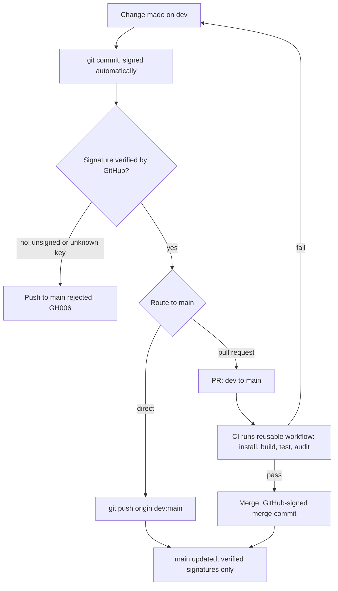

# caller-repo

A small Node.js application that is the reference consumer of this org's reusable build
workflow: [enofei/reusable-build-test](https://github.com/enofei/reusable-build-test).

## Why this repository exists

Two goals. First, prove that adopting the shared pipeline is a one-job change: everything
CI-related lives in `.github/workflows/ci.yml`, and the rest of the repository is ordinary
application code. Second, act as the testbed for this org's branch and signing policy, which
both repositories enforce identically.

## How CI works

```yaml
jobs:
  build-and-test:
    uses: enofei/reusable-build-test/.github/workflows/build-test.yml@<sha>  # v1.0.0
    with:
      node-version: '24'
      test-command: 'npm run test:ci'
      security-checks: true

  sast:
    uses: enofei/reusable-build-test/.github/workflows/sast.yml@<sha>  # v1.0.0
    with:
      semgrep-config: 'policy/semgrep-rules'

  policy:
    if: ${{ always() }}
    needs: [sast]
    uses: enofei/reusable-build-test/.github/workflows/policy.yml@<sha>  # v1.0.0
    with:
      mode: 'enforce-critical'
      policy-path: 'policy/'
```

On every pull request, three jobs run:

1. **Build & Test** — install from the lockfile, build, test, audit deps.
2. **SAST / Semgrep** — digest-pinned Semgrep container scans the repository
   with the rule bundle frozen in `policy/semgrep-rules/` (nothing is fetched
   from the network at scan time) and uploads SARIF to code scanning.
3. **Policy / Gate** — fail-closed OPA gate: downloads the SARIF artifact,
   verifies conftest against an embedded SHA-256, runs the policy unit tests,
   then evaluates `policy/sast.rego`:

| Mode | Behavior |
|---|---|
| `warn` | advisory only — findings annotate the run, never block |
| `enforce-critical` | blocks on first-party findings at error level |
| `enforce-full` | blocks on every first-party finding, any level |

`dvwa/**` is exempt from blocking (it is intentionally vulnerable SAST test
content) but stays visible as warnings. **`main` is clamped to
`enforce-critical` inside the reusable workflow** — callers cannot relax the
mode for merges. Malformed or missing scan results fail the gate (red, never
green). `Policy / Gate` and `SAST / Semgrep` are required status checks on
`main` (break-glass procedure: `plan.md`).

## Branch and signing policy

- `dev` is where work happens. Push to it freely.
- `main` accepts only commits with verified signatures. Branch protection applies to
  administrators too, so unsigned or unverified pushes are rejected by GitHub with `GH006`.
- Signing is automatic on a configured machine: `commit.gpgsign=true` with an SSH signing
  key registered on the GitHub account. `git verify-commit HEAD` checks a commit locally.
- Pull requests can be merged to `main`; GitHub signs its own merge commits, so they pass
  the gate.



## Application layout

| Path | Purpose |
|---|---|
| `src/index.js` | Application code (`slugify`, `greet`) |
| `scripts/build.js` | Bundles `src/` into `dist/` and writes build metadata |
| `test/index.test.js` | Tests on Node's built-in `node:test` runner |

No third-party runtime dependencies. Requires Node.js 24 (current LTS); `engines` is set to
`>=24`.

## Vendored third-party code

| Path | Upstream | License | Purpose |
|---|---|---|---|
| `dvwa/` | [digininja/DVWA](https://github.com/digininja/DVWA) (`43b0f8b`) | GPL-3.0 (`dvwa/COPYING.txt`) | Intentionally vulnerable PHP app used as SAST test content |

`dvwa/` is an unmodified copy of DVWA's source with `.git/` and `.github/` removed; no
upstream workflows or automation run in this repository. It is **not deployed, installed,
or executed here** — only statically analyzed by CI. The rest of this repository remains
MIT-licensed; DVWA's files stay under GPL-3.0 as shipped.

## Local development

```bash
npm ci
npm run build
npm run test:ci
npm audit --audit-level=high
```

These are the same commands CI runs.

## Updating the workflow pin

The `uses:` reference is SHA-pinned to a release tag of `reusable-build-test` with a
`# vX.Y.Z` comment. To resolve a new tag:

```bash
git clone https://github.com/enofei/reusable-build-test.git
./reusable-build-test/scripts/resolve-action-sha.sh enofei/reusable-build-test v1.0.0
# prints: <commit-sha>  # v1.0.0
```

Dependabot also opens weekly PRs proposing pin updates. Note that the reusable repository
publishes a single rolling release tag, so pins only move when that tag is re-cut.
