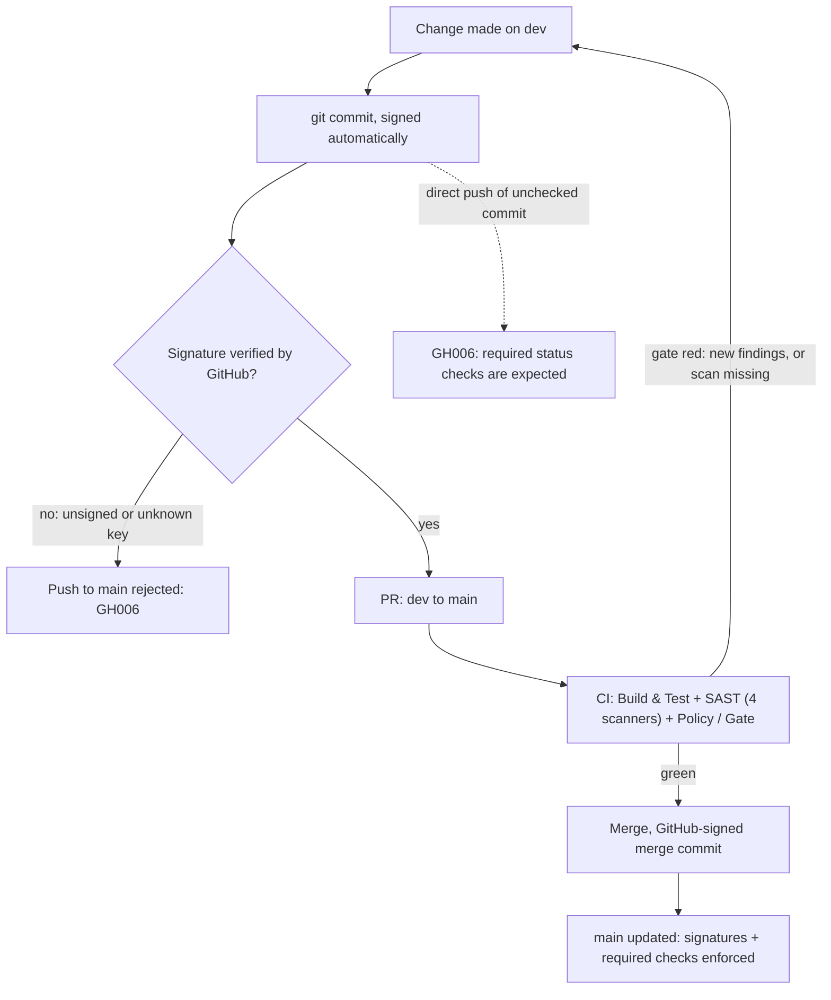

# caller-repo

A small Node.js application that is the reference consumer of this org's reusable build
workflow: [enofei/reusable-build-test](https://github.com/enofei/reusable-build-test).

## Why this repository exists

This repository has two purposes: prove that adopting the shared pipeline is a one-job
change (everything CI-related lives in `.github/workflows/ci.yml`, and the rest of the
repository is ordinary application code), and act as the testbed for this org's branch and
signing policy, which both repositories enforce identically.

## How CI works

```yaml
jobs:
  build-and-test:
    name: Build & Test
    uses: enofei/reusable-build-test/.github/workflows/build-test.yml@57caa3009d1945b109342dc39bc2c7884d779894  # v1.0.0
    with:
      node-version: '24'
      test-command: 'npm run test:ci'
      security-checks: true

  sast:
    name: SAST
    permissions:
      contents: read
      security-events: write
    uses: enofei/reusable-build-test/.github/workflows/sast.yml@57caa3009d1945b109342dc39bc2c7884d779894  # v1.0.0
    with:
      semgrep-config: 'policy/semgrep-rules'

  policy:
    name: Policy
    if: ${{ always() }}
    needs: [sast]
    permissions:
      contents: read
      actions: read
    uses: enofei/reusable-build-test/.github/workflows/policy.yml@57caa3009d1945b109342dc39bc2c7884d779894  # v1.0.0
    with:
      mode: 'enforce-full'
      policy-path: 'policy/'
```

On every pull request, three jobs run:

1. **Build & Test**: install from the lockfile, build, test, audit deps.
2. **SAST**: four scanners, all static (no build), each uploading SARIF to code
   scanning and archiving an artifact for the gate:
   - **Semgrep** — rule bundle frozen in `policy/semgrep-rules/` (nothing fetched
     from the network at scan time)
   - **Gitleaks** — secrets, both the worktree and the full git history;
     documented false positives suppressed via `.gitleaksignore`
   - **Trivy fs** — dependency CVEs from lockfiles and IaC/Dockerfile
     misconfigurations (misconfig checks frozen in the digest-pinned binary;
     vulnerability DB downloaded with Trivy's signature verification)
   - **Dependency Review** — fails on PRs that introduce vulnerable
     dependencies (own required check; no SARIF path)
3. **Policy / Gate**: a fail-closed OPA gate that downloads **all** SARIF
   artifacts (any missing ⇒ red), merges them, verifies conftest against an
   embedded SHA-256, runs the policy unit tests, then evaluates
   `policy/sast.rego` against the findings baseline `policy/baseline.json`:

| Mode | Behavior |
|---|---|
| `warn` | advisory only: findings annotate the run, never block |
| `enforce-critical` | blocks on findings at error level |
| `enforce-full` | blocks on every finding, any level |

There are **no path exemptions**: dvwa findings are scanned and evaluated like
everything else. Known findings are fingerprinted in `policy/baseline.json`
(sha256 of tool+rule+path+message) and suppressed in every mode; anything new —
first-party or dvwa — blocks under enforcement. `main` is clamped to
`enforce-full` inside the reusable workflow, so callers cannot relax the mode
for merges. Malformed or missing scan results or baseline fail the gate (red,
never green). Required status checks on `main`: `Policy / Gate`,
`SAST / Semgrep`, `SAST / Gitleaks`, `SAST / Trivy`, and
`SAST / Dependency Review` (break-glass runbook: below).

Gate modes are exercised on `dev` through `.github/workflows/gate-test.yml`:
`workflow_dispatch` picks `warn` / `enforce-critical` / `enforce-full`, and
every push to `dev` runs a `warn` smoke. Those runs use distinct check names
(`SAST Test / *`, `Gate Test / Gate`) that can never satisfy `main`'s required
checks.

## Security model

Protection works at two layers: the application and the repository itself.

### What protects the application (shift-left)

| Threat | Control |
|---|---|
| Vulnerable code (injection, unsafe `eval`, ...) committed | Semgrep + Gitleaks + Trivy scan every PR; `Policy / Gate` blocks any finding not in the baseline before merge |
| Hardcoded secrets committed | Gitleaks scans worktree + history every PR; Push Protection as a second layer |
| Known-vulnerable dependencies | `npm audit` fails the build; Trivy reads lockfiles without building; Dependency Review blocks PRs that introduce vulnerable deps; Dependabot opens update PRs (7-day cooldown) |
| IaC / Dockerfile / workflow misconfigurations | Trivy misconfig scanner (checks frozen in the digest-pinned binary) |
| Findings in intentional test content | no exemptions: known dvwa findings live in `policy/baseline.json` (reviewed, fingerprinted); new ones block like anything else |

### What protects the repository (zero-trust CI)

| Threat | Control |
|---|---|
| Tampered actions or scanner images | every `uses:` SHA-pinned with `# vX.Y.Z`; Semgrep, Gitleaks, and Trivy run from digest-pinned containers |
| Poisoned rule source at scan time | Semgrep rules vendored in `policy/semgrep-rules/` (hash in `SOURCE.txt`); Trivy misconfig checks frozen in the pinned binary; `.gitleaksignore` reviewed like code |
| Tampered policy toolchain | conftest verified against an embedded SHA-256 before execution |
| Direct push of unchecked code to `main` | required status checks + signatures; rejected with `GH006` (verified by test) |
| Commit forgery | SSH-signed commits required, administrators included |
| History rewrite | force-push and branch deletion disabled on `main` |
| Gate failing open (missing results, missing baseline, invalid mode) | fail-closed: any anomaly = red, never green |
| Loosening the gate on merges | `main` is hard-clamped to `enforce-full` in the reusable workflow; baseline additions are reviewed in signed PRs |

### Defense in depth

`signature check → SAST scan → policy gate → GitHub enforcement`. Four
independent layers: compromising one leaves the others standing. The
pipeline follows established supply-chain practice with immutable pins,
fail-secure defaults, and tooling verified before it runs.

## Branch and signing policy

- `dev` is where work happens. Push to it freely; every push runs the
  `Gate Test` warn-mode smoke, and `workflow_dispatch` exercises any gate mode.
- `main` accepts only commits with verified signatures. Branch protection applies to
  administrators too, so unsigned or unverified pushes are rejected by GitHub with `GH006`.
- Five status checks are required on `main`: `Policy / Gate`, `SAST / Semgrep`,
  `SAST / Gitleaks`, `SAST / Trivy`, and `SAST / Dependency Review`
  (strict, so the branch must be up to date). A direct push of a commit that has
  not passed them is rejected with `GH006`; the admin bypass flag is refused as
  well. In practice, changes land through a pull request. Break-glass (gate
  outage): see the runbook below.
- Signing is automatic on a configured machine: `commit.gpgsign=true` with an SSH signing
  key registered on the GitHub account. `git verify-commit HEAD` checks a commit locally.
- Pull requests can be merged to `main`; GitHub signs its own merge commits, so they pass
  the signature gate, but still have to pass the policy gate.


```mermaid
flowchart TD
    A["Change made on dev"] --> B["git commit, signed automatically"]
    B --> C{"Signature verified by GitHub?"}
    C -->|"no: unsigned or unknown key"| D["Push to main rejected: GH006"]
    C -->|yes| G["PR: dev to main"]
    G --> H["CI: Build & Test + SAST (4 scanners) + Policy / Gate"]
    H -->|"gate red: new findings, or scan missing"| A
    H -->|green| I["Merge, GitHub-signed merge commit"]
    I --> J["main updated: signatures + required checks enforced"]
    B -.->|"direct push of unchecked commit"| K["GH006: required status checks are expected"]
```

### Break-glass runbook (required status checks on main)

With `enforce_admins: true` + required checks, a gate outage blocks all
merges; the UI cannot bypass (`--admin` is refused too). Recovery:

```bash
# 1. remove ONLY the status-check requirement (signatures stay intact)
gh api -X DELETE repos/enofei/caller-repo/branches/main/protection/required_status_checks

# 2. fix the problem; merges reopen (signature requirement remains)

# 3. re-enable: no create sub-endpoint exists: full PUT, mirroring a
#    fresh GET snapshot exactly + the one added key, then verify-diff
gh api repos/enofei/caller-repo/branches/main/protection > /tmp/before.json
#    build PUT body from before.json (all enable-flags verbatim) with
#    "required_status_checks": {"strict": true, "contexts": [
#      "Policy / Gate", "SAST / Semgrep", "SAST / Gitleaks",
#      "SAST / Trivy", "SAST / Dependency Review"]}
gh api -X PUT repos/enofei/caller-repo/branches/main/protection --input /tmp/body.json
gh api repos/enofei/caller-repo/branches/main/protection \
  --jq '{admins: .enforce_admins.enabled, sigs: .required_signatures.enabled, checks: .required_status_checks.contexts, force: .allow_force_pushes.enabled}'
```

Never touch `required_signatures` to solve a gate problem: only
`required_status_checks` is ever added or removed.

## Application layout

| Path | Purpose |
|---|---|
| `src/index.js` | Application code (`slugify`, `greet`) |
| `scripts/build.js` | Bundles `src/` into `dist/` and writes build metadata |
| `test/index.test.js` | Tests on Node's built-in `node:test` runner |
| `policy/sast.rego` | Gate policy: modes, baseline matching, deny/warn rules |
| `policy/sast_test.rego` | Policy unit tests (`conftest verify` runs them in CI) |
| `policy/baseline.json` | Fingerprints of known findings (vendored dvwa corpus) |
| `policy/semgrep-rules/` | Frozen Semgrep rule bundle (provenance: `SOURCE.txt`) |
| `.gitleaksignore` | Documented Gitleaks false positives (vendored rule patterns) |
| `.github/workflows/ci.yml` | PR pipeline: build + SAST + gate |
| `.github/workflows/gate-test.yml` | Dev-branch mode testing (distinct check names) |
| `scripts/update-baseline.sh` | Regenerates `policy/baseline.json` from local scans |
| `scripts/sarif_to_baseline.py` | SARIF → baseline fingerprint generator |

No third-party runtime dependencies. Requires Node.js 24 (current LTS); `engines` is set to
`>=24`.

## Vendored third-party code

| Path | Upstream | License | Purpose |
|---|---|---|---|
| `dvwa/` | [digininja/DVWA](https://github.com/digininja/DVWA) (`43b0f8b`) | GPL-3.0 (`dvwa/COPYING.txt`) | Intentionally vulnerable PHP app used as SAST test content |

`dvwa/` is an unmodified copy of DVWA's source with `.git/` and `.github/` removed; no
upstream workflows or automation run in this repository. It is **not deployed, installed,
or executed here**; CI only analyzes it statically. The rest of this repository remains
MIT-licensed; DVWA's files stay under GPL-3.0 as shipped.

## Local development

```bash
npm ci
npm run build
npm run test:ci
npm audit --audit-level=high
```

These are the same commands CI runs. The policy and scanners can be exercised
locally too:

```bash
conftest verify --policy policy/           # policy unit tests (17)
scripts/update-baseline.sh                 # regenerate baseline.json (needs docker)
```

Baseline updates (tool pin bumps, dvwa re-vendors) are reviewed like code:
every added fingerprint is a finding that stops blocking once merged. The
baseline only accepts `dvwa/` paths — first-party findings are fixed or
allowlisted at the tool level (`.gitleaksignore`), never baselined.

## Updating the workflow pin

The `uses:` reference is SHA-pinned to a release tag of `reusable-build-test` with a
`# vX.Y.Z` comment. To resolve a new tag:

```bash
git clone https://github.com/enofei/reusable-build-test.git
./reusable-build-test/scripts/resolve-action-sha.sh enofei/reusable-build-test v1.0.0
# prints: <commit-sha>  # v1.0.0
```

Dependabot also opens weekly PRs proposing pin updates. Note that the reusable repository
publishes a single rolling release tag, so pins only move when that tag is re-cut.
